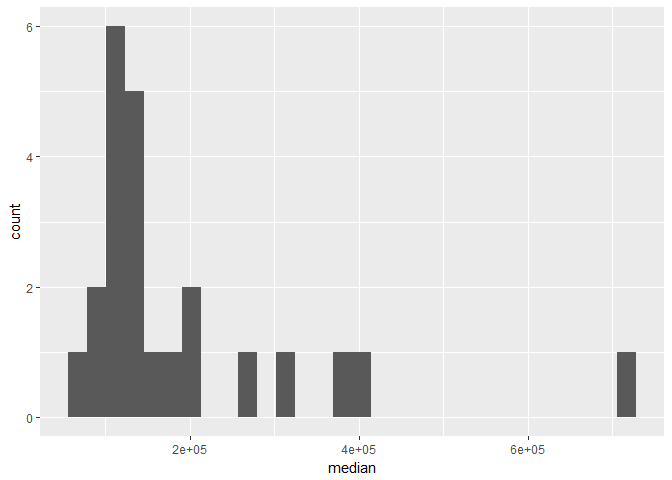
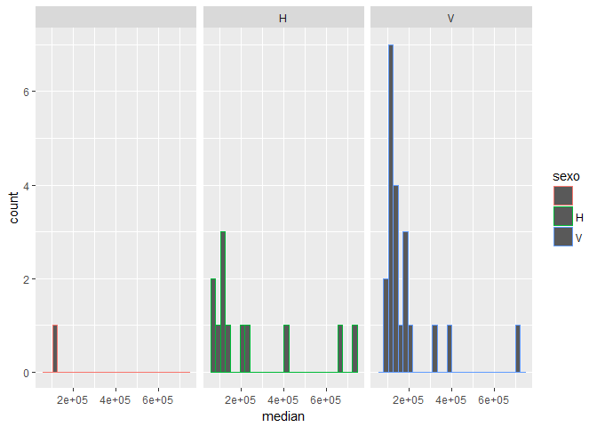
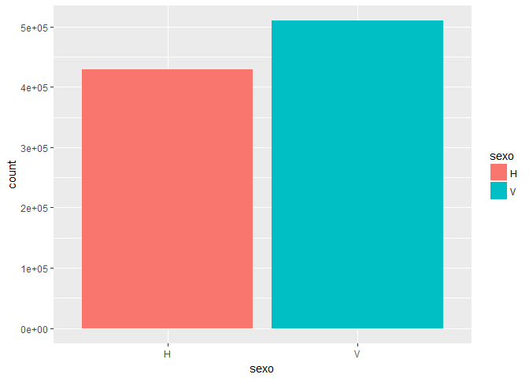

# Exploration & Data Analysis
Pier Lorenzo Paracchini  
11/27/2016  


Using the `tidyverse` package for performing exploration and data analysis.


```r
require(data.table)
require(lubridate)
require(dplyr)
require(knitr)
require(ggplot2)
input_file <- "./../../data/raw/train_ver2.csv"

#Splitting the training data as one file till 2016.04 (included)
input_train <- "./../../data/processed/df_train.RData"
input_train_typesSet <- "./../../data/processed/df_train_typesSet.RData"

#Splitting up the data by periods to have smaller chunks
#2015 split in qurters
#2016 from Jan to April (included)
input_2015_Q1 <- "./../../data/processed/df_2015_Q1.RData"
input_2015_Q2 <- "./../../data/processed/df_2015_Q2.RData"
input_2015_Q3 <- "./../../data/processed/df_2015_Q3.RData"
input_2015_Q4 <- "./../../data/processed/df_2015_Q4.RData"
input_2016 <- "./../../data/processed/df_2016.RData"

#Splitting the test data 2016.05 (only)
input_test <- "./../../data/processed/df_test.RData"
```

## Getting the data


```r
df <- fread(input = input_file, header = T, stringsAsFactors = F)
df$fecha_dato <- lubridate::ymd(df$fecha_dato)
df$fecha_dato_year <- lubridate::year(df$fecha_dato)
df$fecha_dato_month <- lubridate::month(df$fecha_dato)

#Splitting in test & training
idx_train <- df$fecha_dato_year <= 2016 & df$fecha_dato_month <= 4
df_train <- df[idx_train,]
save(df_train, file = input_train)

#Splititng Data horizontally by time
idx_2015_Q1 <- df$fecha_dato_year == 2015 & df$fecha_dato_month <= 3
idx_2015_Q2 <- df$fecha_dato_year == 2015 & (df$fecha_dato_month > 3 & df$fecha_dato_month <= 6)
idx_2015_Q3 <- df$fecha_dato_year == 2015 & (df$fecha_dato_month > 6 & df$fecha_dato_month <= 9)
idx_2015_Q4 <- df$fecha_dato_year == 2015 & df$fecha_dato_month > 9

df_2015_Q1 <- df[idx_2015_Q1,]
df_2015_Q2 <- df[idx_2015_Q2,]
df_2015_Q3 <- df[idx_2015_Q3,]
df_2015_Q4 <- df[idx_2015_Q4,]

idx_2016_til_april <- df$fecha_dato_year == 2016 & df$fecha_dato_month <= 4
idx_test <- df$fecha_dato_year == 2016 & df$fecha_dato_month > 4
df_2016 <- df[idx_2016_til_april,]
df_test <- df[idx_test,]

save(df_2015_Q1, file = input_2015_Q1)
save(df_2015_Q2, file = input_2015_Q2)
save(df_2015_Q3, file = input_2015_Q3)
save(df_2015_Q4, file = input_2015_Q4)

save(df_2016, file = input_2016)
save(df_test, file = input_test)
rm(list = c("df", "df_2015_Q1", "df_2015_Q2", "df_2015_Q3", "df_2015_Q4", "df_2016", "df_test", "df_train"))
rm(list = ls(pattern = "idx_*"))
```

## Data Exploration


```r
load(input_train)
df_train[,fecha_dato_year:= NULL]
df_train[,fecha_dato_month := NULL]

#Training dataset
#Dimension

dim(df_train)

#Structure 
str(df_train)

#Summary
summary(df_train)
```


```r
setDataTypes <- function(x){
    x$ncodpers <- as.factor(x$ncodpers)
    x$ind_empleado <- as.factor(x$ind_empleado)
    x$pais_residencia <- as.factor(x$pais_residencia)
    x$sexo <- as.factor(x$sexo)
    
    x$fecha_alta <- lubridate::ymd(x$fecha_alta)
    
    x$ind_nuevo <- as.factor(x$ind_nuevo)
    x$indrel <- as.factor(x$indrel)
    
    x$ult_fec_cli_1t <- lubridate::ymd(x$ult_fec_cli_1t)
    
    x$indrel_1mes <- as.factor(x$indrel_1mes)
    x$tiprel_1mes <- as.factor(x$tiprel_1mes)
    x$indresi <- as.factor(x$indresi)
    x$indext <- as.factor(x$indext)
    x$conyuemp <- as.factor(x$conyuemp)
    x$canal_entrada <- as.factor(x$canal_entrada)
    x$indfall <- as.factor(x$indfall)
    x$tipodom <- as.factor(x$tipodom)
    x$cod_prov <- as.factor(x$cod_prov)
    x$nomprov <- as.factor(x$nomprov)
    x$ind_actividad_cliente <- as.factor(x$ind_actividad_cliente)
    
    x$segmento <- as.factor(x$segmento)
    x
}

#setting the proper datatypes for the features
df_train <- setDataTypes(df_train)
save(df_train, file = input_train_typesSet)
```


```r
load(input_train_typesSet)

#structure
str(df_train)
## Classes 'data.table' and 'data.frame':	6202950 obs. of  48 variables:
##  $ fecha_dato           : Date, format: "2015-01-28" "2015-01-28" ...
##  $ ncodpers             : Factor w/ 945336 levels "15889","15890",..: 803901 539076 539077 539078 539079 539080 539081 539082 539084 539085 ...
##  $ ind_empleado         : Factor w/ 6 levels "","A","B","F",..: 5 5 5 5 5 5 5 5 5 5 ...
##  $ pais_residencia      : Factor w/ 119 levels "","AD","AE","AL",..: 38 38 38 38 38 38 38 38 38 38 ...
##  $ sexo                 : Factor w/ 3 levels "","H","V": 2 3 3 2 3 2 2 2 2 2 ...
##  $ age                  : int  35 23 23 22 23 23 23 23 24 23 ...
##  $ fecha_alta           : Date, format: "2015-01-12" "2012-08-10" ...
##  $ ind_nuevo            : Factor w/ 2 levels "0","1": 1 1 1 1 1 1 1 1 1 1 ...
##  $ antiguedad           : int  6 35 35 35 35 35 35 35 35 35 ...
##  $ indrel               : Factor w/ 2 levels "1","99": 1 1 1 1 1 1 1 1 1 1 ...
##  $ ult_fec_cli_1t       : Date, format: NA NA ...
##  $ indrel_1mes          : Factor w/ 10 levels "","1","1.0","2",..: 2 2 2 2 2 2 2 2 2 2 ...
##  $ tiprel_1mes          : Factor w/ 6 levels "","A","I","N",..: 2 3 3 3 2 3 3 2 3 3 ...
##  $ indresi              : Factor w/ 3 levels "","N","S": 3 3 3 3 3 3 3 3 3 3 ...
##  $ indext               : Factor w/ 3 levels "","N","S": 2 3 2 2 2 2 2 2 2 2 ...
##  $ conyuemp             : Factor w/ 3 levels "","N","S": 1 1 1 1 1 1 1 1 1 1 ...
##  $ canal_entrada        : Factor w/ 161 levels "","004","007",..: 154 151 151 150 151 151 151 151 151 151 ...
##  $ indfall              : Factor w/ 3 levels "","N","S": 2 2 2 2 2 2 2 2 2 2 ...
##  $ tipodom              : Factor w/ 1 level "1": 1 1 1 1 1 1 1 1 1 1 ...
##  $ cod_prov             : Factor w/ 52 levels "1","2","3","4",..: 29 13 13 50 50 45 24 50 20 10 ...
##  $ nomprov              : Factor w/ 53 levels "","ALAVA","ALBACETE",..: 33 18 18 53 53 49 29 53 22 13 ...
##  $ ind_actividad_cliente: Factor w/ 2 levels "0","1": 2 1 1 1 2 1 1 2 1 1 ...
##  $ renta                : num  87218 35549 122179 119776 NA ...
##  $ segmento             : Factor w/ 4 levels "","01 - TOP",..: 3 4 4 4 4 4 4 4 4 4 ...
##  $ ind_ahor_fin_ult1    : int  0 0 0 0 0 0 0 0 0 0 ...
##  $ ind_aval_fin_ult1    : int  0 0 0 0 0 0 0 0 0 0 ...
##  $ ind_cco_fin_ult1     : int  1 1 1 0 1 1 1 1 1 1 ...
##  $ ind_cder_fin_ult1    : int  0 0 0 0 0 0 0 0 0 0 ...
##  $ ind_cno_fin_ult1     : int  0 0 0 0 0 0 0 0 0 0 ...
##  $ ind_ctju_fin_ult1    : int  0 0 0 0 0 0 0 0 0 0 ...
##  $ ind_ctma_fin_ult1    : int  0 0 0 0 0 0 0 0 0 0 ...
##  $ ind_ctop_fin_ult1    : int  0 0 0 0 0 0 0 0 0 0 ...
##  $ ind_ctpp_fin_ult1    : int  0 0 0 0 0 0 0 0 0 0 ...
##  $ ind_deco_fin_ult1    : int  0 0 0 1 0 0 0 0 0 0 ...
##  $ ind_deme_fin_ult1    : int  0 0 0 0 0 0 0 0 0 0 ...
##  $ ind_dela_fin_ult1    : int  0 0 0 0 0 0 0 0 0 0 ...
##  $ ind_ecue_fin_ult1    : int  0 0 0 0 0 0 0 0 0 0 ...
##  $ ind_fond_fin_ult1    : int  0 0 0 0 0 0 0 0 0 0 ...
##  $ ind_hip_fin_ult1     : int  0 0 0 0 0 0 0 0 0 0 ...
##  $ ind_plan_fin_ult1    : int  0 0 0 0 0 0 0 0 0 0 ...
##  $ ind_pres_fin_ult1    : int  0 0 0 0 0 0 0 0 0 0 ...
##  $ ind_reca_fin_ult1    : int  0 0 0 0 0 0 0 0 0 0 ...
##  $ ind_tjcr_fin_ult1    : int  0 0 0 0 0 0 0 0 0 0 ...
##  $ ind_valo_fin_ult1    : int  0 0 0 0 0 0 0 0 0 0 ...
##  $ ind_viv_fin_ult1     : int  0 0 0 0 0 0 0 0 0 0 ...
##  $ ind_nomina_ult1      : int  0 0 0 0 0 0 0 0 0 0 ...
##  $ ind_nom_pens_ult1    : int  0 0 0 0 0 0 0 0 0 0 ...
##  $ ind_recibo_ult1      : int  0 0 0 0 0 0 0 0 0 0 ...
##  - attr(*, ".internal.selfref")=<externalptr>

#summary
#summary(df_train)
```

### Missing Values/ Empty Values Analysis

Working with all of the data from beginning til April 2016 (included) and trying to answer the following question __Which feature has missing values? Or Which feature (either character or factor) has empty values?__


```r
noOfMissingValues <- function(x){
    #all features
    sum(is.na(x))
}

noOfEmptyValues <- function(x){
    #For character vector and factors
    if(is.character(x) | is.factor(x)){
     sum(x == "")   
    }else{
        0
    }
}

tbl_missing_nas <- sort(sapply(as.list(df_train), FUN = noOfMissingValues), decreasing = T)
tbl_missing_nas <- as.matrix(tbl_missing_nas[tbl_missing_nas > 0])
colnames(tbl_missing_nas) <- "NAs"

tbl_empty <- sort(sapply(as.list(df_train), FUN = noOfEmptyValues), decreasing = T)
tbl_empty <- as.matrix(tbl_empty[tbl_empty > 0])
colnames(tbl_empty) <- "EMPTYs"
```


|                      |     NAs|
|:---------------------|-------:|
|ult_fec_cli_1t        | 6192983|
|renta                 | 1317552|
|cod_prov              |   52928|
|age                   |   22276|
|fecha_alta            |   22276|
|ind_nuevo             |   22276|
|antiguedad            |   22276|
|indrel                |   22276|
|tipodom               |   22276|
|ind_actividad_cliente |   22276|
|ind_nomina_ult1       |   11432|
|ind_nom_pens_ult1     |   11432|


|                |  EMPTYs|
|:---------------|-------:|
|conyuemp        | 6202133|
|segmento        |   55827|
|canal_entrada   |   54569|
|nomprov         |   52928|
|indrel_1mes     |   42498|
|tiprel_1mes     |   42498|
|sexo            |   22306|
|ind_empleado    |   22276|
|pais_residencia |   22276|
|indresi         |   22276|
|indext          |   22276|
|indfall         |   22276|


__ult_fec_cli_1t__, last date as primary customer (if he isn't at the end of the month)

__renta__, Gross income of the household


```r
tmp <- select(df_train, fecha_dato, ncodpers, renta)
renta_an <- group_by(tmp, ncodpers) %>% 
    summarise(min = min(renta, na.rm = T), max = max(renta, na.rm = T), mean = mean(renta, na.rm = T), nas = sum(is.na(renta)))

idx_renta_rentaAvailableSomeNAs <- renta_an$nas > 0 & (!is.na(renta_an$min) | !is.na(renta_an$max) | !is.na(renta_an$mean))
idx_renta_rentaAvailableAllNAs <- renta_an$nas > 0 & (is.na(renta_an$min) & is.na(renta_an$max) & is.na(renta_an$mean))

renta_an_1 <- renta_an[idx_renta_rentaAvailableSomeNAs,]
renta_an_2 <- renta_an[idx_renta_rentaAvailableAllNAs,]
renta_an_1$sameValues <- (renta_an_1$min == renta_an_1$max) & (renta_an_1$mean == renta_an_1$max)
```

From the data below we can see that there are 49 clients (first 10s are visible) where it is posible to recove the missing renta just just using the available renta for the same client not NA. On the other side there are 237690 clients (first 10s are visible) where such information cannot be found.


|ncodpers |       min|       max|      mean| nas|sameValues |
|:--------|---------:|---------:|---------:|---:|:----------|
|183439   | 134512.83| 134512.83| 134512.83|   4|TRUE       |
|227035   | 691513.77| 691513.77| 691513.77|   2|TRUE       |
|237553   | 367279.05| 367279.05| 367279.05|   2|TRUE       |
|258075   | 161469.84| 161469.84| 161469.84|   3|TRUE       |
|314773   |  93224.55|  93224.55|  93224.55|   4|TRUE       |
|329698   |  80374.74|  80374.74|  80374.74|   4|TRUE       |
|407854   |  49531.41|  49531.41|  49531.41|   4|TRUE       |
|508391   | 111592.62| 111592.62| 111592.62|   3|TRUE       |
|511523   |  48663.81|  48663.81|  48663.81|   3|TRUE       |
|525527   | 216098.07| 216098.07| 216098.07|   4|TRUE       |


|ncodpers | min| max| mean| nas|
|:--------|---:|---:|----:|---:|
|15917    |  NA|  NA|  NaN|   8|
|15945    |  NA|  NA|  NaN|   4|
|15980    |  NA|  NA|  NaN|   4|
|15993    |  NA|  NA|  NaN|   8|
|15997    |  NA|  NA|  NaN|   8|
|16022    |  NA|  NA|  NaN|   8|
|16031    |  NA|  NA|  NaN|   8|
|16041    |  NA|  NA|  NaN|   8|
|16048    |  NA|  NA|  NaN|   8|
|16060    |  NA|  NA|  NaN|   8|


```r
df_train[df_train$ncodpers == 183439, c(1:30), with = F]
```


```r
df_train[df_train$ncodpers == 15917, c(1:30), with = F]
df_train[df_train$ncodpers == 16203, c(1:30), with = F]
```

__Initial strategy__ find out the median/ average salary by province using `nomprov` and `sex` as initial sefmenation and use such value for imputation of the entries with missing `renta`


```r
salary_by_country <-  df_train %>% 
    select(pais_residencia,renta) %>%
    group_by(pais_residencia)

salary_by_country_summary <- summarise(salary_by_country, 
                            min = min(renta, na.rm = T),
                            max = min(renta, na.rm = T),
                            mean = mean(renta, na.rm = T),
                            median = median(renta, na.rm = T))

ggplot(salary_by_country_summary, aes(x = median)) +
    geom_histogram()
```

<!-- -->

```r

salary_by_country_sex <-  df_train %>% 
    select(pais_residencia,sexo, renta) %>%
    group_by(pais_residencia, sexo)

salary_by_country_sex_summary <- summarise(salary_by_country_sex, 
                            min = min(renta, na.rm = T),
                            max = min(renta, na.rm = T),
                            mean = mean(renta, na.rm = T),
                            median = median(renta, na.rm = T))

ggplot(salary_by_country_sex_summary, aes(x = median, color = sexo)) +
    geom_histogram() + facet_wrap(facet = ~sexo)
```

<!-- -->

```r

ggplot(salary_by_country_summary, aes(x = median)) +
    geom_histogram()
```

<!-- -->

```r

salary_by_location_sex <-  df_train %>% 
    select(pais_residencia,nomprov,sexo, renta) %>%
    group_by(pais_residencia,nomprov,sexo)

salary_summary <- summarise(salary_by_location_sex, 
                            min = min(renta, na.rm = T),
                            max = min(renta, na.rm = T),
                            mean = mean(renta, na.rm = T),
                            median = median(renta, na.rm = T))
```

## Tell a story


```r
#dataset dimension
dim(df_train)
## [1] 6202950      48

#name of the features included in the dataset
colnames((df_train))
##  [1] "fecha_dato"            "ncodpers"             
##  [3] "ind_empleado"          "pais_residencia"      
##  [5] "sexo"                  "age"                  
##  [7] "fecha_alta"            "ind_nuevo"            
##  [9] "antiguedad"            "indrel"               
## [11] "ult_fec_cli_1t"        "indrel_1mes"          
## [13] "tiprel_1mes"           "indresi"              
## [15] "indext"                "conyuemp"             
## [17] "canal_entrada"         "indfall"              
## [19] "tipodom"               "cod_prov"             
## [21] "nomprov"               "ind_actividad_cliente"
## [23] "renta"                 "segmento"             
## [25] "ind_ahor_fin_ult1"     "ind_aval_fin_ult1"    
## [27] "ind_cco_fin_ult1"      "ind_cder_fin_ult1"    
## [29] "ind_cno_fin_ult1"      "ind_ctju_fin_ult1"    
## [31] "ind_ctma_fin_ult1"     "ind_ctop_fin_ult1"    
## [33] "ind_ctpp_fin_ult1"     "ind_deco_fin_ult1"    
## [35] "ind_deme_fin_ult1"     "ind_dela_fin_ult1"    
## [37] "ind_ecue_fin_ult1"     "ind_fond_fin_ult1"    
## [39] "ind_hip_fin_ult1"      "ind_plan_fin_ult1"    
## [41] "ind_pres_fin_ult1"     "ind_reca_fin_ult1"    
## [43] "ind_tjcr_fin_ult1"     "ind_valo_fin_ult1"    
## [45] "ind_viv_fin_ult1"      "ind_nomina_ult1"      
## [47] "ind_nom_pens_ult1"     "ind_recibo_ult1"

#no of unique customers in the dataset
unique_c_ids <- unique(df_train$ncodpers)
length(unique_c_ids)
## [1] 945336

table(df_train$sexo)
## 
##               H       V 
##   22306 2812620 3368024
sum(is.na(df_train$sexo))
## [1] 0
sum(df_train$sexo == "")
## [1] 22306

by_sex <- df_train %>%
    select(ncodpers, sexo) %>%
    filter(sexo != "") %>%
    group_by(ncodpers, sexo) %>%
    summarise(count = n())

length(unique(by_sex$ncodpers)) == dim(by_sex)[1]
## [1] FALSE

#customers with no sex info 
length(unique_c_ids) - dim(by_sex)[1]
## [1] 6985

#Sex distribution
ggplot(data = by_sex, mapping = aes(x = sexo, fill = sexo)) +
    geom_bar()
```

<!-- -->


```r
by_sex_check <- df_train %>%
    select(ncodpers, sexo) %>%
    filter(sexo != "") %>%
    group_by(ncodpers) %>%
    mutate(isH = any(sexo == "H"), isV = any(sexo == "V"))

tmp <- by_sex_check[by_sex_check$isH==T & by_sex_check$isV == T,]
```


|ncodpers |sexo |isH  |isV  |
|:--------|:----|:----|:----|
|1012963  |V    |TRUE |TRUE |
|1260638  |H    |TRUE |TRUE |
|1181078  |H    |TRUE |TRUE |
|1223219  |V    |TRUE |TRUE |
|1245873  |H    |TRUE |TRUE |
|826999   |V    |TRUE |TRUE |
|769026   |H    |TRUE |TRUE |
|508419   |V    |TRUE |TRUE |
|508419   |V    |TRUE |TRUE |
|769026   |H    |TRUE |TRUE |
|826999   |V    |TRUE |TRUE |
|1245873  |H    |TRUE |TRUE |
|1223219  |V    |TRUE |TRUE |
|1181078  |H    |TRUE |TRUE |
|1260638  |H    |TRUE |TRUE |
|1012963  |V    |TRUE |TRUE |
|508419   |V    |TRUE |TRUE |
|826999   |V    |TRUE |TRUE |
|769026   |H    |TRUE |TRUE |
|1223219  |V    |TRUE |TRUE |
|1260638  |H    |TRUE |TRUE |
|1245873  |H    |TRUE |TRUE |
|1181078  |H    |TRUE |TRUE |
|1012963  |V    |TRUE |TRUE |
|508419   |V    |TRUE |TRUE |
|769026   |H    |TRUE |TRUE |
|826999   |V    |TRUE |TRUE |
|1223219  |V    |TRUE |TRUE |
|1260638  |H    |TRUE |TRUE |
|1245873  |H    |TRUE |TRUE |
|1181078  |H    |TRUE |TRUE |
|1012963  |V    |TRUE |TRUE |
|1499273  |V    |TRUE |TRUE |
|1408093  |V    |TRUE |TRUE |
|1405499  |H    |TRUE |TRUE |
|1405600  |H    |TRUE |TRUE |
|1406383  |H    |TRUE |TRUE |
|1181078  |V    |TRUE |TRUE |
|1245873  |H    |TRUE |TRUE |
|1260638  |H    |TRUE |TRUE |
|1223219  |V    |TRUE |TRUE |
|769026   |H    |TRUE |TRUE |
|826999   |H    |TRUE |TRUE |
|508419   |H    |TRUE |TRUE |
|364089   |V    |TRUE |TRUE |
|1012963  |H    |TRUE |TRUE |
|1245873  |H    |TRUE |TRUE |
|1223219  |H    |TRUE |TRUE |
|1260638  |V    |TRUE |TRUE |
|1499273  |H    |TRUE |TRUE |
|1405600  |V    |TRUE |TRUE |
|1405499  |H    |TRUE |TRUE |
|1406383  |V    |TRUE |TRUE |
|1408093  |V    |TRUE |TRUE |
|508419   |H    |TRUE |TRUE |
|364089   |V    |TRUE |TRUE |
|1012963  |H    |TRUE |TRUE |
|1181078  |V    |TRUE |TRUE |
|826999   |H    |TRUE |TRUE |
|769026   |H    |TRUE |TRUE |
|1406383  |V    |TRUE |TRUE |
|1408093  |V    |TRUE |TRUE |
|1405499  |V    |TRUE |TRUE |
|1405600  |V    |TRUE |TRUE |
|1499273  |H    |TRUE |TRUE |
|1260638  |V    |TRUE |TRUE |
|1245873  |H    |TRUE |TRUE |
|364089   |V    |TRUE |TRUE |
|826999   |H    |TRUE |TRUE |
|769026   |H    |TRUE |TRUE |
|508419   |H    |TRUE |TRUE |
|1223219  |H    |TRUE |TRUE |
|1181078  |V    |TRUE |TRUE |
|1012963  |H    |TRUE |TRUE |
|508419   |H    |TRUE |TRUE |
|1499273  |H    |TRUE |TRUE |
|769026   |V    |TRUE |TRUE |
|826999   |H    |TRUE |TRUE |
|364089   |H    |TRUE |TRUE |
|1181078  |V    |TRUE |TRUE |
|1012963  |H    |TRUE |TRUE |
|1408093  |H    |TRUE |TRUE |
|1405600  |V    |TRUE |TRUE |
|1405499  |V    |TRUE |TRUE |
|1406383  |V    |TRUE |TRUE |
|1245873  |V    |TRUE |TRUE |
|1260638  |V    |TRUE |TRUE |
|1223219  |H    |TRUE |TRUE |


